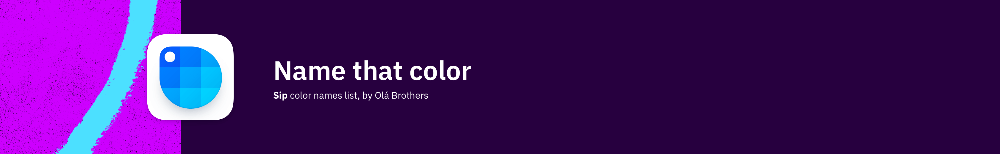

# 🎨 Name That Color

[](./LICENSE.md) 




## 1) Why?

This is the list of color names that we use in our **[Sip](https://sipapp.io)** app, and because we have been asked a few times where the list comes from, we decided to make it public, this is a JSON raw list where the key is the **hex color** and the value is the **name** 🎉

The list is sorted by color code, **`[000000, ..., FFFFFF]`** and we have 2 versions, one with the prefix #, and the other without 🥳

```json
{
   "000000": "Black",
   "0B1304": "Black Forest",
   "2A2630": "Baltic Sea",
   "FFFFFF": "White"
}
```

```json
{
   "#000000": "Black",
   "#0B1304": "Black Forest",
   "#2A2630": "Baltic Sea",
   "#FFFFFF": "White"
}
```

## 2) Usage

Just download the [colors.json](./colors.json) or [colors(#).json](./colors(%23).json) and use it as you wish 🧙‍♂️

## 3) Links

We did use parts of some awesome projects, and here is the list 💫

* [Name that Color by Chirag Mehta](https://chir.ag/projects/name-that-color)
* [W3C Color Names ](https://www.w3.org/wiki/CSS/Properties/color/keywords)

---

We are [Olá Brothers](https://theolabrothers.com). We make [Sip](https://sipapp.io) 🤓

[Twitter](https://twitter.com/olabrothers) | [Github](https://github.com/olabrothers)
